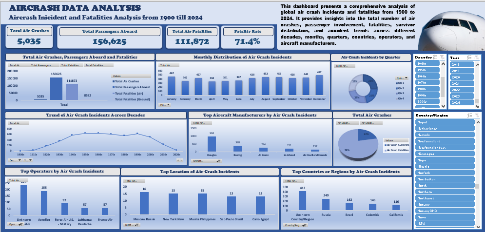

# Global Aviation Incident Analysis ✈️

## Project Overview

An Excel-based analysis of global aviation incident records from **1908 to 2024**, focused on identifying trends in incidents, fatalities, passenger outcomes, aircraft manufacturers, and locations.

## Objectives

* Analyze aviation incident volume and passenger outcomes.
* Identify patterns across months, quarters, and decades.
* Examine incident distribution by aircraft manufacturer and location.
* Build an interactive Excel dashboard to present key insights.

## Tools

**Microsoft Excel**

* Data Cleaning
* Excel Formulas
* Pivot Tables
* Pivot Charts
* KPI Cards
* Slicers
* Dashboard Design

## Data Preparation

The dataset was cleaned and prepared by:

* Removing duplicate records and reviewing inconsistencies.
* Standardizing dates and categorical fields.
* Creating **Month, Quarter, Decade, and Survivor** fields.
* Calculating the overall fatality rate.

## Analysis

The analysis covered:

* Incident frequency
* Fatalities and survivors
* Monthly and quarterly trends
* Decade trends
* Aircraft manufacturers
* Incident locations

## Key Results

| Metric          |  Result |
| --------------- | ------: |
| Total Incidents |   5,035 |
| People Aboard   | 156,625 |
| Fatalities      | 111,872 |
| Survivors       |  44,753 |
| Fatality Rate   |   71.4% |

### Key Highlights

* **December** recorded the highest number of incidents.
* **Q4** had the highest quarterly incident count.
* Incident frequency peaked around the mid-20th century and declined in later decades.
* **Douglas** recorded the highest number of incidents among the manufacturers analyzed.
* **Moscow, New York, Manila, São Paulo and Cairo** were among the locations with the highest incident counts.

## Dashboard

The dashboard combines **KPIs, charts, pivot tables and interactive slicers** for Year, Decade, and Country/Region.

## Key Insight

The analysis reveals clear differences in aviation incident patterns across time, locations, months and aircraft manufacturers. The long-term trend also shows a decline in recorded incidents during later decades.

## Project Outcome

An interactive Excel dashboard that transforms historical aviation data into clear and easy-to-understand insights.
